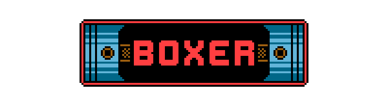

_The logo's left and right ends evoke the horizontally opposed pistons of the boxer engine flat design._

> As long as I can remember, I've always wanted to make games. Somehow I ended up doing it, and a good way for me to enjoy this journey is to build my own game engine and share it with you, hoping it will help you too.

# Boxer
---

_"The Boxer project draws its name from the boxer engine architecture found in cars, symbolizing efficiency in a compact form."_

A minimalist, modern, and lightweight 2D game engine written in C, designed so you can easily build your game around it, favoring direct inclusion rather than linking as a static or shared library.

## Prerequisites

Install the following development dependencies (via your package manager or from source):

  - GNUMake.
  - C compiler.
  - SDL3 (>= 3.4.2).
  - SDL3_image (>= 3.0.0).
  - SDL3_mixer (>= 3.0.0).
  - SDL3_ttf (>= 3.4.0).

## Build and Run

Clone the repo:

```bash
git clone git@github.com:Livy-s-Quest/boxer.git
cd boxer
```

Debug build:

```bash
make DEBUG=1
```

Release build:

```bash
make
```

Run the example game:

```bash
./my_game
```

let's make it roar!

# Project Structure
---

The project is organized as follows:

```bash
data/  # Game assets such as textures, audio, etc.
boxer/ # Core engine source code
game/  # Your game source code
test/  # Unit tests for the engine (take a look for examples of how to use the API)
```

# Project Filesystem
---

Under its hood (or head cover since it's an engine), Boxer uses PhysFS for virtual filesystem management. By default, the following folders are mounted:

- `data.zip` (containing all your game data) is mounted as `data/` **(read-only)**. This is where the game should load assets from, such as textures, audio, etc.
- `the system preferred path` is mounted as `/` **(read/write)**. This is where the game should save user data, such as save files, settings, etc.

This means that files are read from both `data.zip` and `the system preferred path`, but are only written to `the system preferred path`. This allows the game to have a **read-only** assets folder and a separate **read/write** user data folder.

Depending on the operating system, the system preferred path is as follows:

- **Linux:** `~/.local/share/<config->name>/`
- **Windows:** `C:\Users\<username>\AppData\Roaming\<config->name>\`
- **macOS:** `~/Library/Application Support/<config->name>/`

# License
---

This project is licensed under the MIT License
